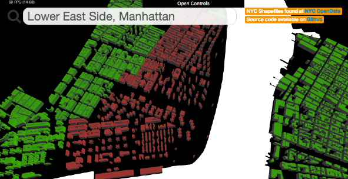
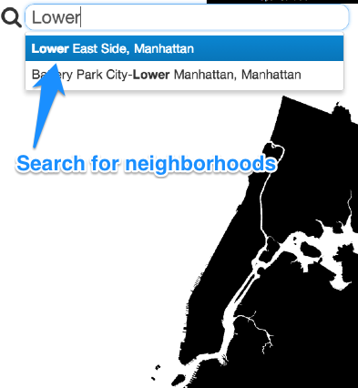
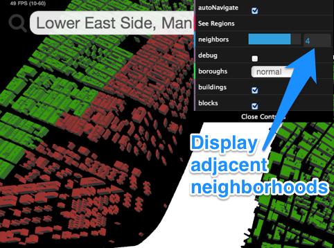
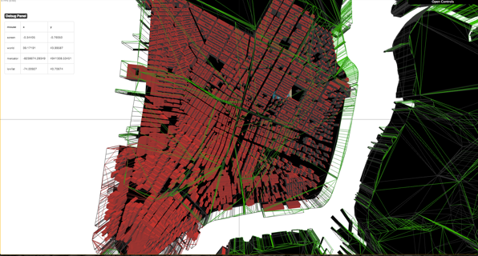
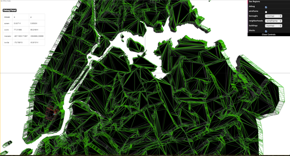
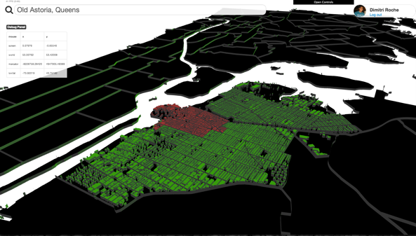
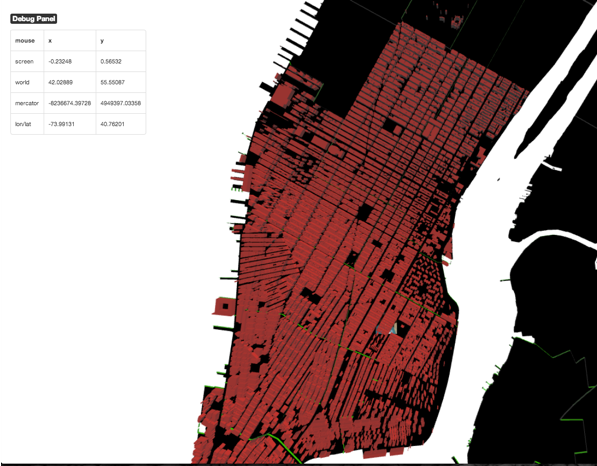

NYC Building Perimeters By Neighborhood
=======================================



Setting Up
----------

Requires Ruby 2.x, node 0.10.x, Postgres 9.2.x, PostGIS 2.x, npm

```
bundle install
npm install
bundle exec rake db:create db:migrate db:seed
bundle exec rails s
```

Using Application
-----------------

#### Search for neighborhoods.



#### Add the number of adjacent neighborhoods to render.



About
-----

Used POSTGIS alongside ruby and node to convert ESRI Shapefiles from [NYC Open Data](https://nycopendata.socrata.com/Facilities-and-Structures/Building-Perimeter-Outlines/r7fd-yd5e)
to [three.js](https://github.com/mrdoob/three.js/) geometries. Front-end uses Spine.js.

Project was used as a learning experience and went through producing three.js
meshes three different ways.

1. Triangulating PostGIS Polygons with [rbpoly2tri](https://github.com/dimroc/rbpoly2tri) in ruby
2. Triangulating in the browser with three.js THREE.Shape
3. Creating a node grunt task of 2 to preprocess the files for users

Settled on **3.**

Batched geometries based on neighborhood but can only show a few neighborhoods at a time due to performance constraints.



Rendered the outline of available neighborhoods, but turned it off 
to speed up download times for demonstration. Even gzipped, content files are obnoxiously large.



Experimented with different perspectives to accentuate the third dimension



Can only reliably render ~4 neighborhoods at a time, until we reach Staten Island. The above image pushes the limit by rendering 10 Manhattan neighborhoods.


